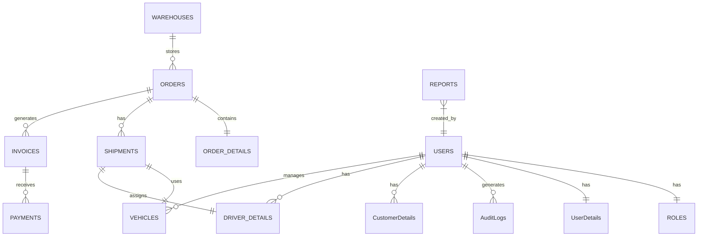

# Transport Management System Database Schema
This document describes the database schema for the TMS application.

## Entity Relationship Diagram


## SQLAlchemy Models

### Imports and Base Declaration
```python
from sqlalchemy import Column, Integer, String, ForeignKey, DateTime, Numeric, Boolean, Text, Index
from sqlalchemy.orm import relationship, declarative_base
from datetime import datetime

Base = declarative_base()
```

### User and Role Models
```python
class User(Base):
    __tablename__ = 'users'
    id = Column(Integer, primary_key=True)
    username = Column(String(50), unique=True, nullable=False)
    email = Column(String(100), unique=True, nullable=False)
    password_hash = Column(String(255), nullable=False)
    is_active = Column(Boolean, default=True)
    created_at = Column(DateTime, default=datetime.utcnow)
    
    role_id = Column(Integer, ForeignKey('roles.id'))
    role = relationship("Role", back_populates="users")
    details = relationship("UserDetails", uselist=False, back_populates="user", cascade="all, delete")
    audit_logs = relationship("AuditLog", back_populates="user")

    __table_args__ = (Index('idx_user_email', 'email'),)

class Role(Base):
    __tablename__ = 'roles'
    id = Column(Integer, primary_key=True)
    name = Column(String(50), unique=True, nullable=False)
    description = Column(String(200))
    
    users = relationship("User", back_populates="role")
```

### User Details Models
```python
class UserDetails(Base):
    __tablename__ = 'user_details'
    id = Column(Integer, primary_key=True)
    user_id = Column(Integer, ForeignKey('users.id'), unique=True)
    phone = Column(String(20))
    address = Column(String(200))
    user = relationship("User", back_populates="details")

class CustomerDetails(Base):
    __tablename__ = 'customer_details'
    id = Column(Integer, primary_key=True)
    user_id = Column(Integer, ForeignKey('users.id'), unique=True)
    company_name = Column(String(100))
    credit_limit = Column(Numeric(10, 2))
    tax_id = Column(String(50))
    
    orders = relationship("Order", back_populates="customer")
    __table_args__ = (Index('idx_customer_company', 'company_name'),)

class DriverDetails(Base):
    __tablename__ = 'driver_details'
    id = Column(Integer, primary_key=True)
    user_id = Column(Integer, ForeignKey('users.id'), unique=True)
    license_number = Column(String(50), unique=True)
    license_expiry = Column(DateTime)
    available = Column(Boolean, default=True)
    
    shipments = relationship("Shipment", back_populates="driver")
    __table_args__ = (Index('idx_driver_license', 'license_number'),)
```

### Vehicle Model
```python
class Vehicle(Base):
    __tablename__ = 'vehicles'
    id = Column(Integer, primary_key=True)
    plate_number = Column(String(20), unique=True)
    vehicle_type = Column(String(50))
    capacity = Column(Numeric(10, 2))
    status = Column(String(20))  # active, maintenance, retired
    
    shipments = relationship("Shipment", back_populates="vehicle")
    __table_args__ = (Index('idx_vehicle_plate', 'plate_number'),)
```

### Warehouse Model
```python
class Warehouse(Base):
    __tablename__ = 'warehouses'
    id = Column(Integer, primary_key=True)
    name = Column(String(100))
    address = Column(String(200))
    capacity = Column(Numeric(10, 2))
    
    orders = relationship("Order", back_populates="warehouse")
    __table_args__ = (Index('idx_warehouse_name', 'name'),)
```

### Order and Order Details Models
```python
class Order(Base):
    __tablename__ = 'orders'
    id = Column(Integer, primary_key=True)
    customer_id = Column(Integer, ForeignKey('customer_details.id'))
    warehouse_id = Column(Integer, ForeignKey('warehouses.id'))
    order_date = Column(DateTime, default=datetime.utcnow)
    status = Column(String(20))
    
    customer = relationship("CustomerDetails", back_populates="orders")
    warehouse = relationship("Warehouse", back_populates="orders")
    details = relationship("OrderDetails", back_populates="order", cascade="all, delete")
    shipments = relationship("Shipment", back_populates="order")
    invoices = relationship("Invoice", back_populates="order")
    
    __table_args__ = (
        Index('idx_order_customer', 'customer_id'),
        Index('idx_order_date', 'order_date')
    )

class OrderDetails(Base):
    __tablename__ = 'order_details'
    id = Column(Integer, primary_key=True)
    order_id = Column(Integer, ForeignKey('orders.id'))
    item_description = Column(String(200))
    quantity = Column(Integer)
    weight = Column(Numeric(10, 2))
    
    order = relationship("Order", back_populates="details")
```

### Shipment Model
```python
class Shipment(Base):
    __tablename__ = 'shipments'
    id = Column(Integer, primary_key=True)
    order_id = Column(Integer, ForeignKey('orders.id'))
    vehicle_id = Column(Integer, ForeignKey('vehicles.id'))
    driver_id = Column(Integer, ForeignKey('driver_details.id'))
    status = Column(String(20))
    departure_time = Column(DateTime)
    arrival_time = Column(DateTime)
    
    order = relationship("Order", back_populates="shipments")
    vehicle = relationship("Vehicle", back_populates="shipments")
    driver = relationship("DriverDetails", back_populates="shipments")
    
    __table_args__ = (
        Index('idx_shipment_order', 'order_id'),
        Index('idx_shipment_status', 'status')
    )
```

### Invoice and Payment Models
```python
class Invoice(Base):
    __tablename__ = 'invoices'
    id = Column(Integer, primary_key=True)
    order_id = Column(Integer, ForeignKey('orders.id'))
    amount = Column(Numeric(10, 2))
    issued_date = Column(DateTime, default=datetime.utcnow)
    due_date = Column(DateTime)
    status = Column(String(20))
    
    order = relationship("Order", back_populates="invoices")
    payments = relationship("Payment", back_populates="invoice")
    
    __table_args__ = (
        Index('idx_invoice_order', 'order_id'),
        Index('idx_invoice_status', 'status')
    )

class Payment(Base):
    __tablename__ = 'payments'
    id = Column(Integer, primary_key=True)
    invoice_id = Column(Integer, ForeignKey('invoices.id'))
    amount = Column(Numeric(10, 2))
    payment_date = Column(DateTime, default=datetime.utcnow)
    payment_method = Column(String(50))
    
    invoice = relationship("Invoice", back_populates="payments")
    __table_args__ = (Index('idx_payment_invoice', 'invoice_id'),)
```

### Audit Log Model
```python
class AuditLog(Base):
    __tablename__ = 'audit_logs'
    id = Column(Integer, primary_key=True)
    user_id = Column(Integer, ForeignKey('users.id'))
    action = Column(String(50))
    table_name = Column(String(50))
    record_id = Column(Integer)
    timestamp = Column(DateTime, default=datetime.utcnow)
    details = Column(Text)
    
    user = relationship("User", back_populates="audit_logs")
    __table_args__ = (
        Index('idx_audit_user', 'user_id'),
        Index('idx_audit_timestamp', 'timestamp')
    )
```

### Report Model
```python
class Report(Base):
    __tablename__ = 'reports'
    id = Column(Integer, primary_key=True)
    created_by = Column(Integer, ForeignKey('users.id'))
    report_type = Column(String(50))
    parameters = Column(Text)
    created_at = Column(DateTime, default=datetime.utcnow)
    result_data = Column(Text)
    
    creator = relationship("User")
    __table_args__ = (Index('idx_report_type', 'report_type'),)
```

## Description
### Key Relationship Decisions:
- User-Role: One-to-many relationship allowing each user to have a single role
- User-Details: One-to-one relationships with UserDetails, CustomerDetails, and DriverDetails using unique constraints
- Order Flow: Orders -> OrderDetails (one-to-one) -> Shipments (one-to-many) -> Invoices (one-to-many) -> Payments (one-to-many)
- Warehouse-Order: One-to-many as orders are associated with specific warehouses
- Vehicle-Shipment: One-to-many allowing vehicles to be used for multiple shipments over time
- AuditLog: Generic audit logging system tracking all major changes
- Reports: Separate table for storing generated reports with parameters and results

### Indexing Strategy:
- Primary keys on all tables
- Unique indexes on username, email, license numbers, plate numbers
- Performance indexes on frequently queried fields (order_date, shipment_status, etc.)
- Foreign key indexes for join operations
- Compound indexes for commonly combined search criteria