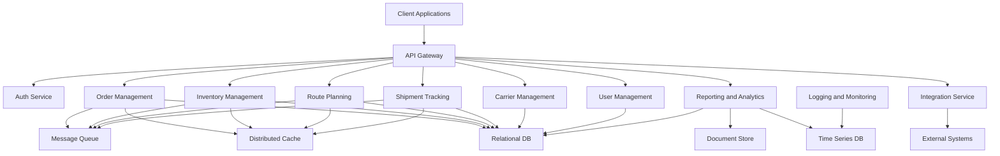
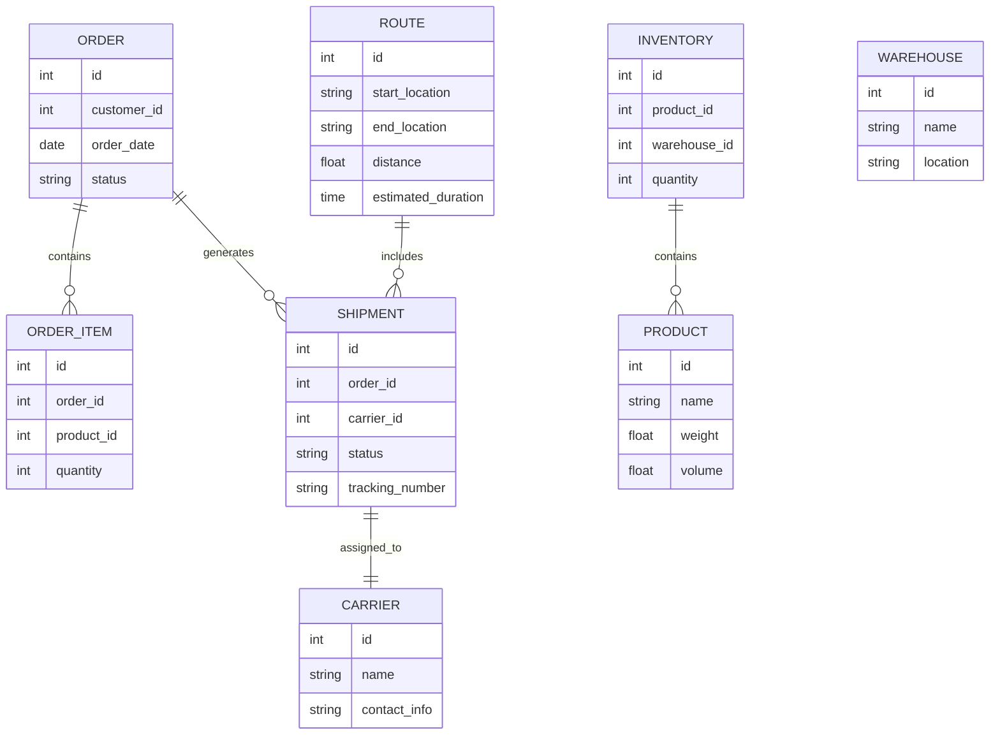
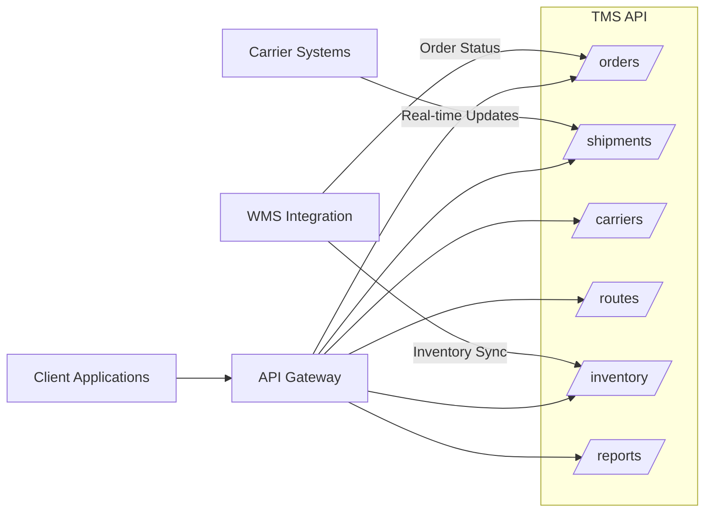
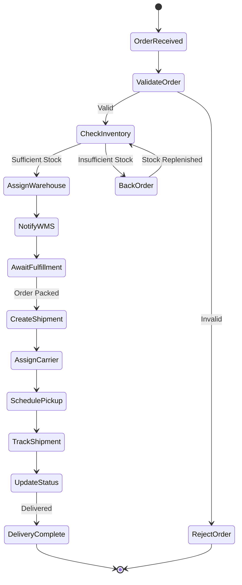
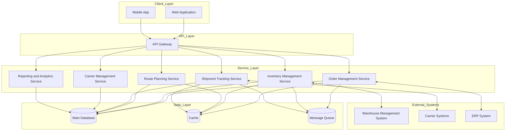
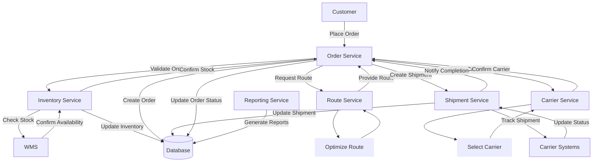

# Transportation Management System Design

## 1. System Overview

The Transportation Management System (TMS) is designed to optimize and manage the movement of goods and resources across a
transportation network. It will handle various aspects of transportation logistics, including route planning, carrier selection,
shipment tracking, and reporting. The system will integrate with a Warehouse Management System (WMS) to ensure seamless
coordination between transportation and warehousing operations.

## 2. Key Components

### 2.1 User Interface

- Web-based dashboard built with React for administrators and logistics managers
- Mobile-responsive design for field personnel access via web browsers

### 2.2 Core Modules

- Order Management
- Route Planning and Optimization
- Carrier Management
- Shipment Tracking
- Inventory Management (with WMS integration)
- Reporting and Analytics

### 2.3 Integration Layer

- RESTful APIs for connecting with external systems, including WMS
- Webhook support for real-time updates

### 2.4 Data Storage

- SQLite3 database for all structured data

### 2.5 Security Layer

- Authentication and authorization
- Data encryption
- Audit logging

## 3. Technical Architecture

### 3.1 Frontend

- React.js for web dashboard
- Redux for state management
- Axios for API communication

### 3.2 Backend

- Flask web framework
- SQLAlchemy ORM for database interactions
- Flask-RESTful for API development

### 3.3 Data Storage

- SQLite3 for local development and small to medium-scale deployments
- (Option for future scaling: PostgreSQL for larger deployments)

### 3.4 Caching

- Flask-Caching with simple caching for improved performance

### 3.5 Task Queue

- Celery for handling background tasks and scheduled jobs

## 4. Key Features

- Real-time shipment tracking
- Automated route optimization
- Carrier performance analytics
- Predictive ETA calculations
- Customizable alerts and notifications
- Document management (e.g., bills of lading, proofs of delivery)
- WMS integration for inventory sync and order fulfillment

## 5. WMS Integration

### 5.1 Shared Data

- Inventory levels
- Order statuses
- Shipping information

### 5.2 Integration Points

- Inventory synchronization
- Order fulfillment requests
- Inbound shipment notifications
- Returns processing

### 5.3 Integration Methods

- RESTful API calls between TMS and WMS
- Webhook notifications for real-time updates
- Scheduled data synchronization jobs

## 6. Database Schema (Main Tables)

```sql
-- Orders
CREATE TABLE orders (
    id INTEGER PRIMARY KEY,
    customer_id INTEGER,
    order_date DATE,
    status VARCHAR(50),
    -- Other relevant fields
);

-- Shipments
CREATE TABLE shipments (
    id INTEGER PRIMARY KEY,
    order_id INTEGER,
    carrier_id INTEGER,
    status VARCHAR(50),
    tracking_number VARCHAR(100),
    -- Other relevant fields
);

-- Carriers
CREATE TABLE carriers (
    id INTEGER PRIMARY KEY,
    name VARCHAR(100),
    contact_info TEXT,
    -- Other relevant fields
);

-- Vehicles
CREATE TABLE vehicles (
    id INTEGER PRIMARY KEY,
    carrier_id INTEGER,
    vehicle_type VARCHAR(50),
    capacity FLOAT,
    -- Other relevant fields
);

-- Routes
CREATE TABLE routes (
    id INTEGER PRIMARY KEY,
    shipment_id INTEGER,
    start_location VARCHAR(100),
    end_location VARCHAR(100),
    estimated_duration INTEGER,
    -- Other relevant fields
);

-- Inventory (synced with WMS)
CREATE TABLE inventory (
    id INTEGER PRIMARY KEY,
    product_id INTEGER,
    quantity INTEGER,
    warehouse_id INTEGER,
    -- Other relevant fields
);
```

## 7. API Endpoints (Main Routes)

```python
# Orders
@app.route('/api/orders', methods=['GET', 'POST'])
@app.route('/api/orders/<int:order_id>', methods=['GET', 'PUT', 'DELETE'])

# Shipments
@app.route('/api/shipments', methods=['GET', 'POST'])
@app.route('/api/shipments/<int:shipment_id>', methods=['GET', 'PUT', 'DELETE'])

# Carriers
@app.route('/api/carriers', methods=['GET', 'POST'])
@app.route('/api/carriers/<int:carrier_id>', methods=['GET', 'PUT', 'DELETE'])

# Routes
@app.route('/api/routes', methods=['GET', 'POST'])
@app.route('/api/routes/<int:route_id>', methods=['GET', 'PUT', 'DELETE'])

# Inventory (WMS integration)
@app.route('/api/inventory', methods=['GET'])
@app.route('/api/inventory/<int:product_id>', methods=['GET'])

# WMS Integration
@app.route('/api/wms/sync-inventory', methods=['POST'])
@app.route('/api/wms/order-fulfillment', methods=['POST'])
```

## 8. Scalability and Performance

- Optimize database queries using SQLAlchemy
- Implement caching strategies for frequently accessed data
- Use connection pooling for database connections
- Consider moving to a more robust database (e.g., PostgreSQL) for larger deployments

## 9. Security Measures

- Use Flask-Login for user session management
- Implement role-based access control (RBAC)
- Use HTTPS for all communications
- Sanitize and validate all user inputs
- Regularly update dependencies to patch security vulnerabilities

## 10. Deployment

- Use Docker for containerization
- Consider using Gunicorn as the WSGI HTTP Server
- Nginx as a reverse proxy server
- Implement CI/CD pipelines for automated testing and deployment

# Transportation Management System: User Roles and Responsibilities

## 1. User Roles

Based on your suggestions and considering typical TMS requirements, here's a refined list of user roles:

1. Admin
2. Transportation Manager
3. Carrier
4. Customer/Shipper
5. Driver
6. Finance/Accounting
7. Warehouse Manager
8. Dispatcher
9. Customer Service Representative

## 2. Role Descriptions and Tasks

### 2.1 Admin

The Admin has full system access and is responsible for system configuration and user management.

Tasks:

- Manage user accounts and permissions
- Configure system settings
- Monitor system performance and security
- Manage integrations with other systems (e.g., WMS, ERP)
- Generate and analyze system-wide reports

### 2.2 Transportation Manager

The Transportation Manager oversees the entire transportation operation and makes strategic decisions.

Tasks:

- Plan and optimize transportation strategies
- Analyze performance metrics and KPIs
- Manage relationships with carriers and key customers
- Approve major decisions (e.g., new carrier contracts, large shipments)
- Review and act on exception reports

### 2.3 Carrier

Carriers are external entities responsible for transporting goods.

Tasks:

- Update availability and capacity information
- Accept or reject shipment requests
- Provide real-time updates on shipment status
- Submit documentation (e.g., proof of delivery, invoices)
- Manage their fleet and driver information

### 2.4 Customer/Shipper

Customers or Shippers are the entities requesting transportation services.

Tasks:

- Create and manage shipping orders
- Track shipments in real-time
- Communicate special requirements for shipments
- Review and approve quotes
- Access and download shipping documentation

### 2.5 Driver

Drivers are responsible for the actual transportation of goods.

Tasks:

- Update their status and location
- Receive and confirm delivery instructions
- Report issues or delays during transit
- Capture and upload delivery confirmation and documentation
- Log hours of service and compliance information

### 2.6 Finance/Accounting

The Finance/Accounting role handles all financial aspects of the transportation operations.

Tasks:

- Generate and send invoices
- Process payments to carriers
- Reconcile financial transactions
- Manage billing disputes
- Generate financial reports and forecasts

### 2.7 Warehouse Manager

The Warehouse Manager oversees warehouse operations and coordinates with transportation.

Tasks:

- Manage inventory levels and locations
- Coordinate inbound and outbound shipments
- Oversee loading and unloading operations
- Ensure proper packaging and labeling of shipments
- Manage warehouse staff and resources

### 2.8 Dispatcher

The Dispatcher coordinates daily transportation activities and manages communication between various parties.

Tasks:

- Assign shipments to carriers and drivers
- Optimize routes and schedules
- Monitor real-time shipment progress
- Manage exceptions and rerouting
- Communicate with drivers, carriers, and customers

### 2.9 Customer Service Representative

Customer Service Representatives handle inquiries and issues from customers and carriers.

Tasks:

- Respond to customer inquiries about shipments
- Handle complaints and resolve issues
- Provide shipping quotes and information
- Assist customers with using the TMS platform
- Escalate complex issues to appropriate departments

## 3. Role-Based Access Control (RBAC)

To implement these roles in the TMS, we'll use a Role-Based Access Control system. Here's a high-level overview of how this could be structured in the database:

```sql
CREATE TABLE roles (
    id INTEGER PRIMARY KEY,
    name VARCHAR(50) UNIQUE NOT NULL
);

CREATE TABLE permissions (
    id INTEGER PRIMARY KEY,
    name VARCHAR(50) UNIQUE NOT NULL
);

CREATE TABLE role_permissions (
    role_id INTEGER,
    permission_id INTEGER,
    PRIMARY KEY (role_id, permission_id),
    FOREIGN KEY (role_id) REFERENCES roles (id),
    FOREIGN KEY (permission_id) REFERENCES permissions (id)
);

CREATE TABLE users (
    id INTEGER PRIMARY KEY,
    username VARCHAR(50) UNIQUE NOT NULL,
    password_hash VARCHAR(128) NOT NULL,
    role_id INTEGER,
    FOREIGN KEY (role_id) REFERENCES roles (id)
);
```

# Transportation Management System: User Roles and Core Module Interactions

## 1. Core Modules

Let's first recap the core modules of our TMS:

1. Order Management
2. Route Planning and Optimization
3. Carrier Management
4. Shipment Tracking
5. Inventory Management (with WMS integration)
6. Reporting and Analytics

## 2. Role Interactions with Core Modules

### 2.1 Order Management Module

- **Customer/Shipper**: Creates new shipping orders, views order status, modifies or cancels orders.
- **Customer Service Representative**: Assists customers with order creation, handles order inquiries and modifications.
- **Transportation Manager**: Reviews and approves high-value or complex orders, manages order priorities.
- **Dispatcher**: Assigns carriers and drivers to orders, manages order fulfillment process.
- **Warehouse Manager**: Receives order details, prepares inventory for shipment.
- **Finance/Accounting**: Generates invoices based on order details, tracks order-related financial transactions.

### 2.2 Route Planning and Optimization Module

- **Dispatcher**: Creates and optimizes routes, assigns drivers to routes.
- **Transportation Manager**: Reviews and approves proposed routes, analyzes route efficiency.
- **Driver**: Receives route information, provides feedback on route feasibility.
- **Carrier**: Provides input on vehicle availability and capabilities for route planning.
- **Admin**: Configures route optimization parameters and constraints.

### 2.3 Carrier Management Module

- **Transportation Manager**: Manages carrier relationships, negotiates contracts, evaluates carrier performance.
- **Carrier**: Updates company information, manages fleet details, sets availability.
- **Dispatcher**: Selects carriers for specific shipments based on availability and performance.
- **Finance/Accounting**: Manages carrier payments and financial agreements.
- **Admin**: Sets up new carrier accounts, manages carrier access to the system.

### 2.4 Shipment Tracking Module

- **Customer/Shipper**: Tracks shipment status in real-time, receives notifications on shipment progress.
- **Driver**: Updates shipment status and location information.
- **Dispatcher**: Monitors all active shipments, manages exceptions and delays.
- **Customer Service Representative**: Provides shipment status updates to customers, handles tracking-related inquiries.
- **Warehouse Manager**: Tracks inbound shipments for resource planning.

### 2.5 Inventory Management Module (with WMS integration)

- **Warehouse Manager**: Manages inventory levels, coordinates with WMS for accurate stock information.
- **Transportation Manager**: Views inventory levels for shipment planning.
- **Customer Service Representative**: Checks inventory availability for customer inquiries.
- **Admin**: Manages WMS integration, ensures data synchronization.

### 2.6 Reporting and Analytics Module

- **Admin**: Configures system-wide reports, manages access to analytics.
- **Transportation Manager**: Analyzes performance metrics, generates strategic reports.
- **Finance/Accounting**: Generates financial reports, analyzes cost and revenue data.
- **Carrier**: Views performance reports related to their shipments.
- **Customer/Shipper**: Accesses reports on their shipping history and performance.

## 3. Cross-Module Interactions

To illustrate how these modules and roles interact in a typical workflow, let's consider the lifecycle of an order:

1. **Order Creation**:

   - The Customer/Shipper creates an order in the Order Management module.
   - The system checks inventory availability through the Inventory Management module.
   - The Customer Service Representative may assist with the order creation process.

2. **Order Processing**:

   - The Dispatcher receives the new order in the Order Management module.
   - Using the Route Planning and Optimization module, the Dispatcher creates an optimal route.
   - The Carrier Management module is used to select the best carrier for the shipment.

3. **Shipment Execution**:

   - The selected Carrier and Driver receive the shipment details.
   - The Warehouse Manager prepares the inventory for shipment, updating the Inventory Management module.
   - As the shipment progresses, the Driver updates the Shipment Tracking module.

4. **Monitoring and Support**:

   - The Dispatcher and Customer Service Representative monitor the shipment through the Shipment Tracking module.
   - The Customer/Shipper receives updates and can track the shipment's progress.

5. **Completion and Reporting**:
   - Upon delivery, the Driver confirms completion in the Shipment Tracking module.
   - The Finance/Accounting role generates an invoice through the Order Management module.
   - The Transportation Manager reviews performance data in the Reporting and Analytics module.

## 4. Implementation Considerations

To support these interactions in our Flask and React-based TMS:

1. **API Design**: Create RESTful endpoints for each module, with appropriate permissions for different roles.

   ```python
   @app.route('/api/orders', methods=['POST'])
   @role_required(['Customer', 'CustomerServiceRep'])
   def create_order():
       # Order creation logic
       pass

   @app.route('/api/shipments/<int:shipment_id>/status', methods=['PUT'])
   @role_required(['Driver'])
   def update_shipment_status(shipment_id):
       # Shipment status update logic
       pass
   ```

2. **Frontend Components**: Develop role-specific dashboards and interfaces in React.

   ```jsx
   function DispatcherDashboard() {
     return (
       <div>
         <OrderList />
         <RouteOptimizer />
         <ShipmentTracker />
       </div>
     );
   }
   ```

3. **Real-time Updates**: Implement WebSocket connections for live updates on shipment tracking and inventory changes.

4. **Data Access Layer**: Use SQLAlchemy to create models with role-based access controls.

   ```python
   class Order(db.Model):
       # ... other fields ...

       @staticmethod
       def visible_to(user):
           if user.role.name in ['Admin', 'TransportationManager']:
               return Order.query
           elif user.role.name == 'Customer':
               return Order.query.filter_by(customer_id=user.id)
           # ... other role-based filters ...
   ```

5. **Integration Points**: Develop clear interfaces for WMS integration in the Inventory Management module.

# Transportation Management System: Integration with Warehouse Management System

## 1. Overview of TMS-WMS Integration

The integration between the Transportation Management System (TMS) and the Warehouse Management System (WMS) is critical for efficient supply chain operations. This integration ensures real-time synchronization of inventory, order, and shipment data between transportation and warehousing processes.

## 2. Key Integration Points

### 2.1 Inventory Management

- Real-time inventory levels
- Stock location within warehouses
- Inventory reservations and allocations

### 2.2 Order Fulfillment

- Order details and status
- Pick and pack information
- Shipment readiness status

### 2.3 Inbound Shipments

- Advanced Shipping Notices (ASN)
- Receiving schedules
- Dock door assignments

### 2.4 Outbound Shipments

- Shipment details and documentation
- Loading schedules
- Carrier information

## 3. Data Flow Between TMS and WMS

### 3.1 TMS to WMS

- New orders for fulfillment
- Inbound shipment notifications
- Carrier and transportation details
- Estimated arrival times

### 3.2 WMS to TMS

- Inventory levels and stock locations
- Order status updates
- Shipment readiness notifications
- Proof of delivery confirmations

## 4. Integration Architecture

We'll use a RESTful API approach for the TMS-WMS integration, with webhook support for real-time updates.

### 4.1 API Endpoints

```python
# TMS API endpoints for WMS
@app.route('/api/wms/orders', methods=['POST'])
def receive_order_from_wms():
    # Logic to receive and process new orders from WMS
    pass

@app.route('/api/wms/inventory', methods=['GET'])
def get_inventory_for_wms():
    # Logic to provide current inventory levels to WMS
    pass

# WMS API endpoints for TMS
@app.route('/api/tms/shipment_status', methods=['PUT'])
def update_shipment_status():
    # Logic to update shipment status in TMS
    pass

@app.route('/api/tms/asn', methods=['POST'])
def receive_asn():
    # Logic to process Advanced Shipping Notices
    pass
```

### 4.2 Webhook Support

```python
@app.route('/api/webhooks/inventory_update', methods=['POST'])
def inventory_update_webhook():
    # Logic to handle real-time inventory updates from WMS
    pass

@app.route('/api/webhooks/order_status_change', methods=['POST'])
def order_status_change_webhook():
    # Logic to handle order status changes from WMS
    pass
```

## 5. Key Processes and Their Implementation

### 5.1 Order Creation and Fulfillment

1. Order received in TMS
2. TMS checks inventory availability with WMS
3. TMS sends order details to WMS for fulfillment
4. WMS updates order status as it's processed
5. WMS notifies TMS when order is ready for shipment

```python
def create_order(order_data):
    # Create order in TMS
    order = Order.create(order_data)

    # Check inventory with WMS
    inventory_status = requests.get(f"{WMS_API_URL}/inventory", params={"items": order.items})

    if inventory_status.is_sufficient():
        # Send order to WMS for fulfillment
        wms_response = requests.post(f"{WMS_API_URL}/orders", json=order.to_dict())

        if wms_response.is_success():
            order.update(status="In Fulfillment")
        else:
            order.update(status="Fulfillment Error")
    else:
        order.update(status="Insufficient Inventory")

    return order
```

### 5.2 Inventory Synchronization

1. WMS sends real-time inventory updates to TMS
2. TMS processes updates and reflects changes in its system
3. TMS uses updated inventory data for order planning and routing decisions

```python
@app.route('/api/webhooks/inventory_update', methods=['POST'])
def inventory_update_webhook():
    inventory_data = request.json

    for item in inventory_data:
        Inventory.update_or_create(
            item_id=item['id'],
            quantity=item['quantity'],
            location=item['location']
        )

    # Trigger any necessary actions based on inventory changes
    check_low_stock_alerts(inventory_data)
    update_order_fulfillment_status(inventory_data)

    return jsonify({"status": "success"}), 200
```

### 5.3 Shipment Coordination

1. TMS creates shipment plan
2. TMS sends shipment details to WMS
3. WMS prepares shipment and updates status
4. WMS notifies TMS when shipment is ready for pickup
5. TMS dispatches carrier for pickup

```python
def create_shipment(order_id):
    order = Order.get(order_id)
    shipment = Shipment.create(order=order)

    # Send shipment details to WMS
    wms_response = requests.post(f"{WMS_API_URL}/shipments", json=shipment.to_dict())

    if wms_response.is_success():
        shipment.update(status="Preparing")

        # Set up webhook to listen for shipment ready notification
        webhook_url = url_for('shipment_ready_webhook', shipment_id=shipment.id, _external=True)
        requests.post(f"{WMS_API_URL}/webhooks", json={"url": webhook_url, "event": "shipment_ready"})
    else:
        shipment.update(status="Preparation Error")

    return shipment

@app.route('/api/webhooks/shipment_ready', methods=['POST'])
def shipment_ready_webhook():
    shipment_data = request.json
    shipment = Shipment.get(shipment_data['id'])

    shipment.update(status="Ready for Pickup")

    # Dispatch carrier for pickup
    dispatch_carrier(shipment)

    return jsonify({"status": "success"}), 200
```

## 6. Error Handling and Resilience

- Implement retry mechanisms for failed API calls
- Use message queues (e.g., Celery with Redis) for asynchronous processing
- Set up monitoring and alerting for integration failures
- Implement data validation and sanitation for all incoming data from WMS

## 7. Security Considerations

- Use OAuth 2.0 for API authentication between TMS and WMS
- Implement rate limiting to prevent API abuse
- Use HTTPS for all API communications
- Regularly audit and rotate API keys

## 8. Testing the Integration

- Develop comprehensive unit tests for all integration points
- Create integration tests simulating various scenarios (e.g., inventory changes, order status updates)
- Perform regular end-to-end tests of the entire order-to-shipment process
- Set up a staging environment that mimics the production setup for thorough testing

# TMS-WMS Integration: Detailed Workflow and Multi-Company Scenarios

## 1. Database Schema for WMS-related Data in TMS

First, let's look at how we might structure our database to handle WMS-related data:

```sql
-- Warehouses
CREATE TABLE warehouses (
    id INTEGER PRIMARY KEY,
    name VARCHAR(100) NOT NULL,
    location VARCHAR(255) NOT NULL,
    company_id INTEGER,
    wms_integration_id VARCHAR(50),
    FOREIGN KEY (company_id) REFERENCES companies(id)
);

-- Inventory
CREATE TABLE inventory (
    id INTEGER PRIMARY KEY,
    product_id INTEGER,
    warehouse_id INTEGER,
    quantity INTEGER,
    last_updated TIMESTAMP,
    FOREIGN KEY (product_id) REFERENCES products(id),
    FOREIGN KEY (warehouse_id) REFERENCES warehouses(id)
);

-- Orders
CREATE TABLE orders (
    id INTEGER PRIMARY KEY,
    customer_id INTEGER,
    status VARCHAR(50),
    created_at TIMESTAMP,
    updated_at TIMESTAMP,
    FOREIGN KEY (customer_id) REFERENCES customers(id)
);

-- Order Items
CREATE TABLE order_items (
    id INTEGER PRIMARY KEY,
    order_id INTEGER,
    product_id INTEGER,
    quantity INTEGER,
    warehouse_id INTEGER,
    status VARCHAR(50),
    FOREIGN KEY (order_id) REFERENCES orders(id),
    FOREIGN KEY (product_id) REFERENCES products(id),
    FOREIGN KEY (warehouse_id) REFERENCES warehouses(id)
);

-- WMS Integration Logs
CREATE TABLE wms_integration_logs (
    id INTEGER PRIMARY KEY,
    warehouse_id INTEGER,
    event_type VARCHAR(50),
    payload TEXT,
    status VARCHAR(50),
    created_at TIMESTAMP,
    FOREIGN KEY (warehouse_id) REFERENCES warehouses(id)
);
```

This schema allows us to track inventory across multiple warehouses, associate orders with specific warehouses, and log integration events with various WMS systems.

## 2. Detailed Workflow

Let's break down the workflow for processing an order:

1. **Order Reception**:

   - Orders can be received from various sources (e-commerce platform, EDI, manual entry).
   - The Customer Service Representative or an automated system checks incoming orders.

2. **Order Validation**:

   - The TMS validates the order (e.g., product availability, customer credit).
   - If valid, the order status is updated to "Validated".

3. **Inventory Check**:

   - The TMS queries the relevant WMS for current inventory levels.
   - If sufficient inventory exists, the order moves to "Ready for Fulfillment".

4. **Warehouse Assignment**:

   - The TMS assigns the order to a specific warehouse based on inventory availability and proximity to the customer.

5. **WMS Notification**:

   - The TMS sends the order details to the assigned warehouse's WMS.

6. **Pick and Pack**:

   - Warehouse staff receive picking instructions through their WMS.
   - Items are picked from their locations and brought to a packing station.
   - Packers prepare the items for shipment.

7. **Shipment Creation**:

   - Once packed, the WMS notifies the TMS that the order is ready for shipment.
   - The TMS creates a shipment record and plans the transportation.

8. **Carrier Assignment**:

   - The TMS assigns a carrier based on shipping requirements and contracts.

9. **Shipment Pickup**:

   - The assigned carrier picks up the shipment from the warehouse.

10. **Tracking and Delivery**:
    - The TMS tracks the shipment and updates stakeholders on its progress.
    - Upon delivery, the TMS records the completion and updates the order status.

## 3. Multi-Company WMS Scenarios

Your question touches on a crucial aspect of supply chain management: the interaction between different companies' systems. Let's consider two scenarios:

### Scenario 1: "Example Tech Company Logistics" (ETCL)

In this case, ETCL is using the TMS to manage its own inventory and fulfill customer orders.

- ETCL has its own WMS managing one or more warehouses.
- The TMS integrates directly with ETCL's WMS.
- When inventory runs low, the TMS can trigger purchase orders to suppliers.

### Scenario 2: "Example Supplier For Tech Companies" (ESFTC)

Here, ESFTC is a supplier to companies like ETCL.

- ESFTC has its own WMS managing its inventory.
- ETCL's TMS doesn't directly integrate with ESFTC's WMS.
- Instead, ETCL's TMS would integrate with ESFTC's order management or ERP system.

### How They Work Together

1. **Inventory Management**:

   - ETCL's TMS regularly syncs inventory levels with its own WMS.
   - When inventory for a product falls below a threshold, the TMS triggers a reorder process.

2. **Ordering from Supplier**:

   - ETCL's TMS creates a purchase order for ESFTC.
   - This order is sent to ESFTC's order management system, not directly to their WMS.

3. **Supplier Processing**:

   - ESFTC receives the order in their system.
   - ESFTC's system communicates with their WMS to fulfill the order.

4. **Shipment from Supplier**:

   - ESFTC's WMS manages the picking, packing, and shipping process.
   - ESFTC's system sends shipping information back to ETCL's TMS.

5. **Receiving at ETCL**:
   - ETCL's TMS creates an inbound shipment record.
   - When the shipment arrives, ETCL's WMS processes the receipt.
   - The received inventory is then reflected in ETCL's WMS and synced back to the TMS.

## 4. Implementation Considerations

To handle these multi-company scenarios, consider the following in your TMS design:

1. **Company Relationships**:

   ```python
   class Company(db.Model):
       id = db.Column(db.Integer, primary_key=True)
       name = db.Column(db.String(100), nullable=False)
       type = db.Column(db.String(50))  # 'own', 'supplier', 'customer'

   class CompanyRelationship(db.Model):
       id = db.Column(db.Integer, primary_key=True)
       company_id = db.Column(db.Integer, db.ForeignKey('company.id'))
       related_company_id = db.Column(db.Integer, db.ForeignKey('company.id'))
       relationship_type = db.Column(db.String(50))  # 'supplier', 'customer'
   ```

2. **Integration Points**:

   ```python
   class IntegrationPoint(db.Model):
       id = db.Column(db.Integer, primary_key=True)
       company_id = db.Column(db.Integer, db.ForeignKey('company.id'))
       integration_type = db.Column(db.String(50))  # 'wms', 'erp', 'oms'
       api_endpoint = db.Column(db.String(255))
       auth_method = db.Column(db.String(50))
   ```

3. **Order Processing**:

   ```python
   def process_reorder(product_id, quantity):
       supplier = get_preferred_supplier(product_id)
       integration_point = IntegrationPoint.query.filter_by(
           company_id=supplier.id,
           integration_type='oms'
       ).first()

       if integration_point:
           send_purchase_order(integration_point, product_id, quantity)
       else:
           notify_procurement_team(product_id, quantity, supplier.id)
   ```

This structure allows your TMS to manage relationships with multiple companies (own warehouses, suppliers, customers) and integrate with their systems as appropriate, whether that's a direct WMS integration or communication with an order management system.

# Transportation Management System: System Architecture and Deployment Strategy

## 1. System Architecture Overview

Our TMS will follow a microservices architecture to ensure scalability, maintainability, and flexibility. Here's an overview of the key components:

### 1.1 Core Microservices

1. **Order Management Service**
2. **Inventory Management Service**
3. **Route Planning Service**
4. **Shipment Tracking Service**
5. **Carrier Management Service**
6. **Reporting and Analytics Service**
7. **User Management Service**
8. **Integration Service** (for WMS, ERP, etc.)

### 1.2 Shared Components

1. **API Gateway**
2. **Authentication and Authorization Service**
3. **Message Queue**
4. **Distributed Cache**
5. **Logging and Monitoring Service**

### 1.3 Data Stores

1. **Relational Database** (PostgreSQL)
2. **Document Store** (MongoDB for unstructured data)
3. **Time Series Database** (InfluxDB for metrics and logs)

## 2. Detailed Architecture Diagram



## 3. Technology Stack

- **Backend Services**: Python with Flask
- **Frontend**: React
- **API Gateway**: Kong or AWS API Gateway
- **Message Queue**: RabbitMQ
- **Cache**: Redis
- **Databases**:
  - PostgreSQL (Relational)
  - MongoDB (Document Store)
  - InfluxDB (Time Series)
- **Container Orchestration**: Kubernetes
- **CI/CD**: Jenkins or GitLab CI
- **Monitoring**: Prometheus and Grafana

## 4. Deployment Strategy

We'll use a container-based deployment strategy with Kubernetes for orchestration. This approach offers flexibility, scalability, and ease of management.

### 4.1 Containerization

Each microservice will be containerized using Docker. Here's an example Dockerfile for one of our services:

```dockerfile
FROM python:3.9-slim

WORKDIR /app

COPY requirements.txt .
RUN pip install --no-cache-dir -r requirements.txt

COPY . .

CMD ["gunicorn", "-b", "0.0.0.0:5000", "app:app"]
```

### 4.2 Kubernetes Deployment

We'll use Kubernetes to manage our containerized services. Here's an example Kubernetes deployment YAML for the Order Management Service:

```yaml
apiVersion: apps/v1
kind: Deployment
metadata:
  name: order-management
spec:
  replicas: 3
  selector:
    matchLabels:
      app: order-management
  template:
    metadata:
      labels:
        app: order-management
    spec:
      containers:
        - name: order-management
          image: our-registry/order-management:latest
          ports:
            - containerPort: 5000
          env:
            - name: DATABASE_URL
              valueFrom:
                secretKeyRef:
                  name: db-secrets
                  key: url
            - name: REDIS_URL
              value: "redis-master.default.svc.cluster.local"
```

### 4.3 CI/CD Pipeline

We'll implement a CI/CD pipeline using Jenkins or GitLab CI. Here's a simplified example of a CI/CD pipeline:

1. **Code Commit**: Developer pushes code to Git repository
2. **Automated Testing**: Run unit and integration tests
3. **Build Docker Image**: Create a new Docker image with the updated code
4. **Push to Registry**: Push the Docker image to our container registry
5. **Deploy to Staging**: Automatically deploy to staging environment
6. **Manual Approval**: Require manual approval for production deployment
7. **Deploy to Production**: Roll out the new version to production

### 4.4 Blue-Green Deployment

For zero-downtime updates, we'll use a blue-green deployment strategy:

1. Deploy the new version (green) alongside the current version (blue)
2. Gradually shift traffic from blue to green
3. If any issues occur, quickly rollback by shifting traffic back to blue
4. Once green is stable, decommission the blue version

## 5. Scaling Strategy

- **Horizontal Scaling**: Use Kubernetes' Horizontal Pod Autoscaler to automatically scale services based on CPU utilization or custom metrics
- **Database Scaling**: Implement read replicas for PostgreSQL to handle increased read traffic
- **Caching**: Utilize Redis caching to reduce database load for frequently accessed data
- **CDN**: Use a Content Delivery Network for static assets to improve global performance

## 6. Monitoring and Logging

- **Centralized Logging**: Use the ELK stack (Elasticsearch, Logstash, Kibana) for log aggregation and analysis
- **Metrics**: Use Prometheus for collecting and storing metrics, with Grafana for visualization
- **Alerting**: Set up alerting rules in Prometheus Alertmanager to notify on-call personnel of any issues
- **Tracing**: Implement distributed tracing using Jaeger to monitor and troubleshoot microservices

## 7. Security Considerations

- **Network Policies**: Implement Kubernetes Network Policies to control traffic between pods
- **Secrets Management**: Use Kubernetes Secrets or a dedicated secret management system like HashiCorp Vault
- **Authentication**: Implement OAuth 2.0 and OpenID Connect for secure authentication
- **Encryption**: Use TLS for all service-to-service communication
- **Regular Audits**: Conduct regular security audits and penetration testing

# Transportation Management System: Final Design Overview

## 1. System Purpose and Scope

The Transportation Management System (TMS) is designed to optimize and manage the movement of goods across a supply chain. It integrates with Warehouse Management Systems (WMS) and handles various aspects of transportation logistics, including order management, route planning, shipment tracking, and reporting.

## 2. Key Features

- Order Management
- Route Planning and Optimization
- Carrier Management
- Real-time Shipment Tracking
- Inventory Management (with WMS integration)
- Reporting and Analytics
- Multi-company Support (own operations, suppliers, customers)

## 3. System Architecture

### 3.1 Microservices

- Order Management Service
- Inventory Management Service
- Route Planning Service
- Shipment Tracking Service
- Carrier Management Service
- Reporting and Analytics Service
- User Management Service
- Integration Service (for WMS, ERP, etc.)

### 3.2 Shared Components

- API Gateway
- Authentication and Authorization Service
- Message Queue (RabbitMQ)
- Distributed Cache (Redis)
- Logging and Monitoring Service

### 3.3 Data Stores

- Relational Database (PostgreSQL)
- Document Store (MongoDB)
- Time Series Database (InfluxDB)

## 4. Technology Stack

- Backend: Python with Flask
- Frontend: React
- Containerization: Docker
- Orchestration: Kubernetes
- CI/CD: Jenkins or GitLab CI
- Monitoring: Prometheus and Grafana

## 5. Key Workflows

### 5.1 Order Processing

1. Order received and validated
2. Inventory checked across warehouses
3. Order assigned to appropriate warehouse
4. WMS notified for fulfillment
5. Shipment created and carrier assigned
6. Real-time tracking until delivery

### 5.2 Inventory Management

1. Regular syncing with WMS
2. Reorder points trigger purchase orders
3. Incoming shipments update inventory levels

### 5.3 Route Optimization

1. Orders grouped for efficient delivery
2. Routes optimized based on various factors (distance, time, cost)
3. Drivers assigned to routes

## 6. Integration Points

- WMS Integration for inventory and order fulfillment
- ERP Integration for financial data
- Carrier Systems Integration for real-time tracking
- Customer Systems Integration for order placement and status updates

## 7. Security Measures

- OAuth 2.0 for authentication
- Role-Based Access Control (RBAC)
- Data encryption in transit and at rest
- Regular security audits and penetration testing

## 8. Scalability and Performance

- Horizontal scaling of microservices
- Database read replicas and sharding
- Caching strategies for frequently accessed data
- CDN for static asset delivery

## 9. Monitoring and Maintenance

- Centralized logging (ELK stack)
- Real-time monitoring and alerting (Prometheus and Grafana)
- Automated backups and disaster recovery procedures

## 10. Deployment Strategy

- Containerized deployments with Kubernetes
- Blue-Green deployment for zero-downtime updates
- Automated CI/CD pipeline for reliable and frequent releases

## 11. User Roles and Access

- Admin
- Transportation Manager
- Carrier
- Customer/Shipper
- Driver
- Finance/Accounting
- Warehouse Manager
- Dispatcher
- Customer Service Representative

## 12. Compliance and Regulations

- GDPR compliance for handling personal data
- Industry-specific regulations (e.g., FMCSA for US trucking)

## 13. Future Considerations

- Machine Learning for predictive analytics and demand forecasting
- IoT integration for real-time vehicle and cargo monitoring
- Blockchain for transparent and secure supply chain tracking
- Mobile app development for drivers and field personnel

## 14. Implementation Roadmap

1. Core Services Development (Order, Inventory, Shipment)
2. WMS Integration
3. Route Optimization Engine
4. Carrier Management and Integration
5. Reporting and Analytics
6. Advanced Features (ML, IoT)

## 15. Key Performance Indicators (KPIs)

- On-Time Delivery Rate
- Cost per Shipment
- Inventory Turnover Rate
- Route Efficiency
- Customer Satisfaction Score

## 16. Final Considerations

- User Training: Develop comprehensive training programs for all user roles
- Change Management: Plan for organizational changes that may result from system implementation
- Data Migration: If replacing an existing system, carefully plan and execute data migration
- Pilot Testing: Consider a phased rollout, starting with a pilot group before full implementation
- Feedback Loop: Establish mechanisms for continuous user feedback and system improvement
- Documentation: Maintain thorough documentation for system architecture, APIs, and user guides

# Diagrams

```mermaid
    graph TD
        A[Transportation Management System] --> B[Order Management]
        A --> C[Route Planning and Optimization]
        A --> D[Carrier Management]
        A --> E[Real-time Shipment Tracking]
        A --> F[Inventory Management]
        A --> G[Reporting and Analytics]
        A --> H[WMS Integration]
        A --> I[Multi-company Support]
        B --> B1[Order Creation]
        B --> B2[Order Fulfillment]
        C --> C1[Optimal Route Generation]
        C --> C2[Driver Assignment]
        D --> D1[Carrier Selection]
        D --> D2[Performance Tracking]
        E --> E1[GPS Integration]
        E --> E2[Status Updates]
        F --> F1[Stock Level Tracking]
        F --> F2[Reorder Management]
        G --> G1[KPI Dashboards]
        G --> G2[Custom Reports]
        H --> H1[Inventory Sync]
        H --> H2[Order Status Updates]
        I --> I1[Own Operations]
        I --> I2[Suppliers]
        I --> I3[Customers]
```












